# Livrable 4 — Data Lineage

> *"Le data lineage désigne la traçabilité du parcours d'une donnée, depuis sa source jusqu'à ses transformations et ses usages finaux."* — Atwal, H. (2019), *Practical DataOps*, cité au Chapitre 3.
> *"Sans lineage, les erreurs circulent plus vite que leur explication."* (Chapitre 3)

Le cours présente le flux générique **Source → Ingestion → Transformation → Produit data → Usage** (Chapitre 3, slide 18). Ce document l'instancie pour le pipeline de détection de fraude.

## Diagramme de lignage

```mermaid
flowchart LR
    A["Source\nKaggle creditcard.csv\n(284 807 lignes, statique)"] -->|"dlt (ingestion_dlt/run_pipeline.py)\n@dlt.resource, lecture par chunks"| B["Ingestion\nDuckDB : raw.transactions_raw\n+ _dlt_load_id, _dlt_id"]
    B -->|"quality/validate_schema.py\n(shift-left)"| C{"Validation\nschéma + nullité + domaine"}
    C -->|"dbt staging"| D["stg_transactions\n(typage, transaction_id, load_id)"]
    D -->|"dbt marts"| E["fct_transactions_clean\n(amount >= 0)"]
    E -->|"dbt marts"| F["fct_transactions_features\n(hour_of_day, log_amount, amount_bucket)"]
    E -->|"dbt marts"| G["agg_fraud_hourly_summary\n(produit analytique)"]
    F -->|"ml/train.py (Phase D)"| H["MLflow\nExperiment Tracking + Registry"]
    H -->|"ml/register_model.py"| I["Modèle enregistré\nfraud-detection-classifier"]
    I -->|"api/model_loader.py (Phase E)"| J["Service FastAPI\nPOST /predict"]
    J -->|"monitoring/ (Phase F)"| K["Logs de prédiction\n+ rapport de dérive"]
    G -->|"reporting"| L["Data Analyst\ndashboards"]

    style A fill:#eee,stroke:#888
    style H fill:#dde,stroke:#557
    style J fill:#ded,stroke:#575
```

*(Orchestré de bout en bout par Dagster — `orchestration_dagster/fraud_dagster/job.py` — qui enchaîne les étapes Ingestion → Validation → Transformation → Tests visibles dans les logs de run.)*

## Table de lignage détaillée

| Étape | Entrée | Traitement | Sortie | Code |
|---|---|---|---|---|
| Source | — | Téléchargement manuel (Kaggle, licence non redistribuable) | `data/raw/creditcard.csv` | — |
| Ingestion | `creditcard.csv` | Lecture par chunks de 50 000 lignes, chargement `write_disposition="replace"` | `raw.transactions_raw` (DuckDB) + colonnes `_dlt_load_id`/`_dlt_id` | `ingestion_dlt/sources.py`, `run_pipeline.py` |
| Validation | `raw.transactions_raw` | Contrôle schéma, nullité, domaine (shift-left) | Exception bloquante si échec | `quality/validate_schema.py` |
| Staging | `raw.transactions_raw` | Typage, renommage, clé surrogate `transaction_id` (= `_dlt_id`) | `stg_transactions` (vue) | `dbt_fraud/models/staging/stg_transactions.sql` |
| Mart (clean) | `stg_transactions` | Filtre `amount >= 0` | `fct_transactions_clean` (table) | `dbt_fraud/models/marts/fct_transactions_clean.sql` |
| Mart (features) | `fct_transactions_clean` | Dérivation `hour_of_day`, `log_amount`, `amount_bucket` | `fct_transactions_features` (table) | `dbt_fraud/models/marts/fct_transactions_features.sql` |
| Mart (agrégat) | `fct_transactions_features` | Agrégation par heure | `agg_fraud_hourly_summary` (table) | `dbt_fraud/models/marts/agg_fraud_hourly_summary.sql` |
| ML (Phase D) | `fct_transactions_features` | Split, entraînement, évaluation | Run MLflow + modèle enregistré | `ml/train.py` 🚧 |
| Service (Phase E) | Modèle enregistré | Chargement + scoring temps réel | Réponse `POST /predict` | `api/main.py` 🚧 |
| Monitoring (Phase F) | Réponses API | Journalisation + comparaison de distribution | Rapport de dérive | `monitoring/drift_check.py` 🚧 |

## Mécanismes de traçabilité utilisés (les "5 Q" du Chapitre 1)

| Question | Réponse dans ce pipeline |
|---|---|
| Quelle donnée ? | Nombre de lignes ingérées, visible dans le `load_info` affiché par `run_pipeline.py` |
| Quelle version ? | `_dlt_load_id` (horodatage unique du run d'ingestion), propagé jusqu'aux marts via la colonne `load_id` |
| Quel modèle ? | Nom + version dans le MLflow Model Registry (Phase D) |
| Quel responsable ? | Tag `trained_by` sur chaque run MLflow (Phase D) ; auteur du commit Git pour le code |
| Quelle validation ? | Statut `dbt test` (27 tests, Chapitre 3) au moment du run, tag `dbt_test_status` sur le run MLflow (Phase D) |

## Limite assumée

Le graphe de lignage ci-dessus est documenté manuellement (approche retenue : pattern `@op`/`@job` Dagster classique plutôt que Software-Defined Assets, pour rester fidèle au TP validé par le professeur). Un projet de plus grande échelle utiliserait un outil de lignage automatique (OpenLineage, Marquez — non couverts par le cours) ou les *Software-Defined Assets* de Dagster, qui génèrent ce graphe automatiquement dans l'UI.
